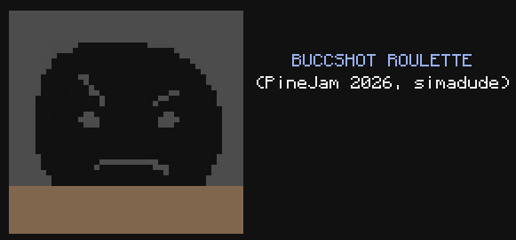

# buccshot

*A fan-made text-based recreation of [Buckshot Roulette](https://store.steampowered.com/app/2835570/Buckshot_Roulette/) for CC: Tweaked.*



## How to Play

1. Copy `buccshot.lua` onto a CC: Tweaked computer.
2. Run it:
```
buccshot
```

### Items

| Item              | Effect                                            |
| ------            | --------                                          |
| Beer              | Eject the current shell without firing            |
| Handcuffs         | Skip the opponent's next turn                     |
| Magnifying Glass  | Peek at the current shell (live or blank)         |
| Phone             | Reveal a random future shell position             |
| Handsaw           | Next live shot deals double damage                |
| Cigarettes        | Heal 1 HP                                         |
| Adrenaline        | Steal a random item from the opponent             |
| Inverter          | Flip the current shell type between live and blank|

The game spans 3 rounds with increasing health and item count after each round. The Dealer uses similar AI to the original game.

---

## Credits

* Original game [Buckshot Roulette](https://store.steampowered.com/app/2835570/Buckshot_Roulette/) developed by Mike Klubnika
* [OST track "General Release"](https://www.youtube.com/watch?v=GXvHmYwcmF0) from the Buckshot Roulette soundtrack
* Dealer AI ported from the [decompilation of game's source code](https://github.com/thecatontheceiling/buckshotroulette/blob/main/DealerIntelligence.gd)